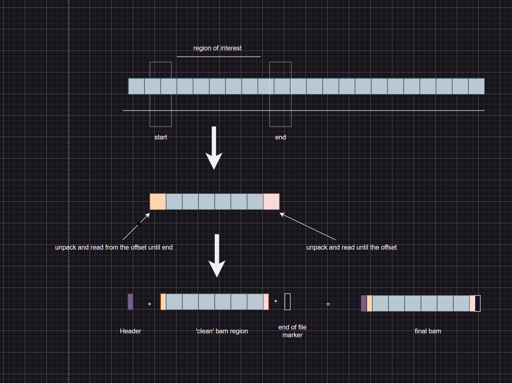

* used  https://github.com/betteridiot/bamnostic bai parser

# requirements
* pysam 
* bamnostic
* biopython
* io
* gzip

# Script usage

```python
python extract_bam_region.py <bam_file> <bai_file> <region> <output_file>
```

# Logic used
